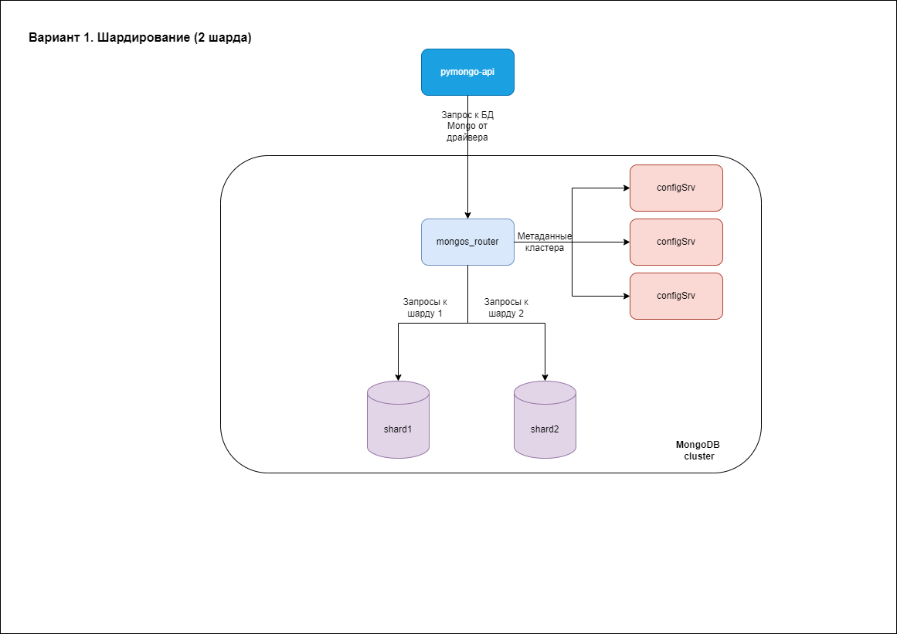
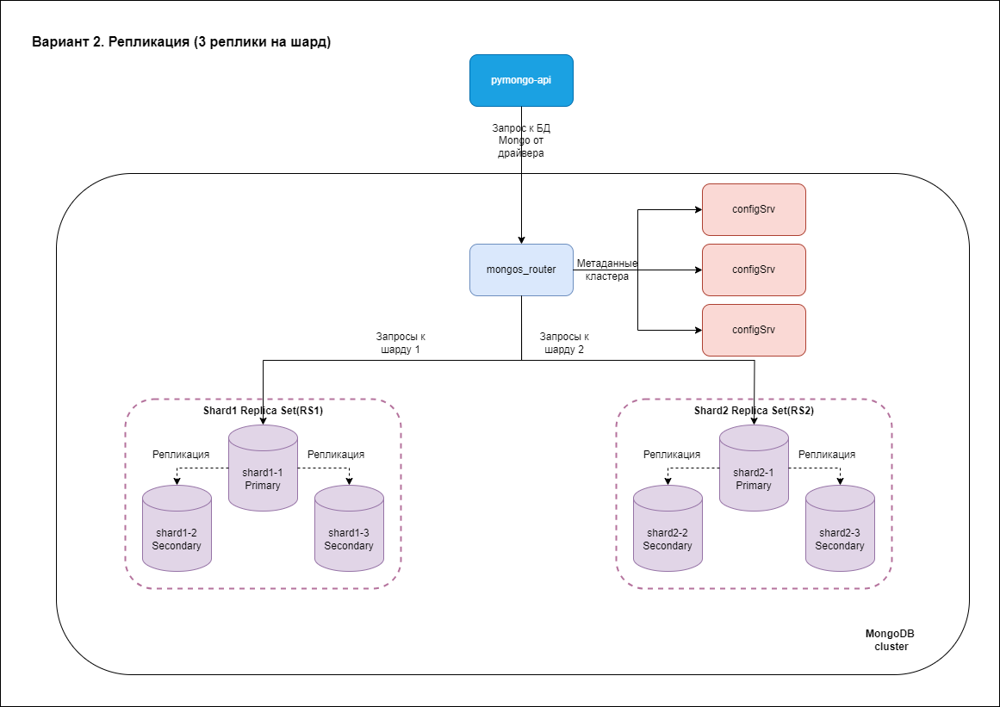
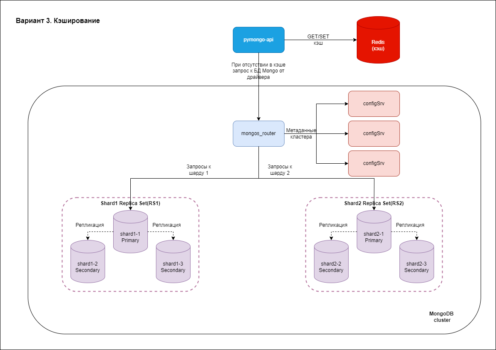
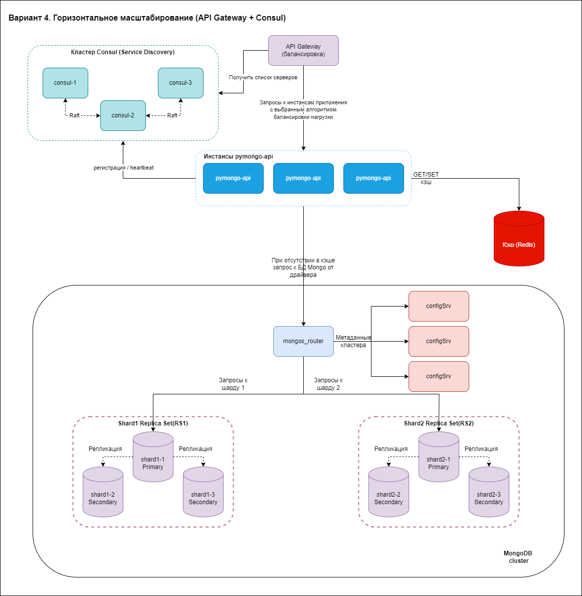
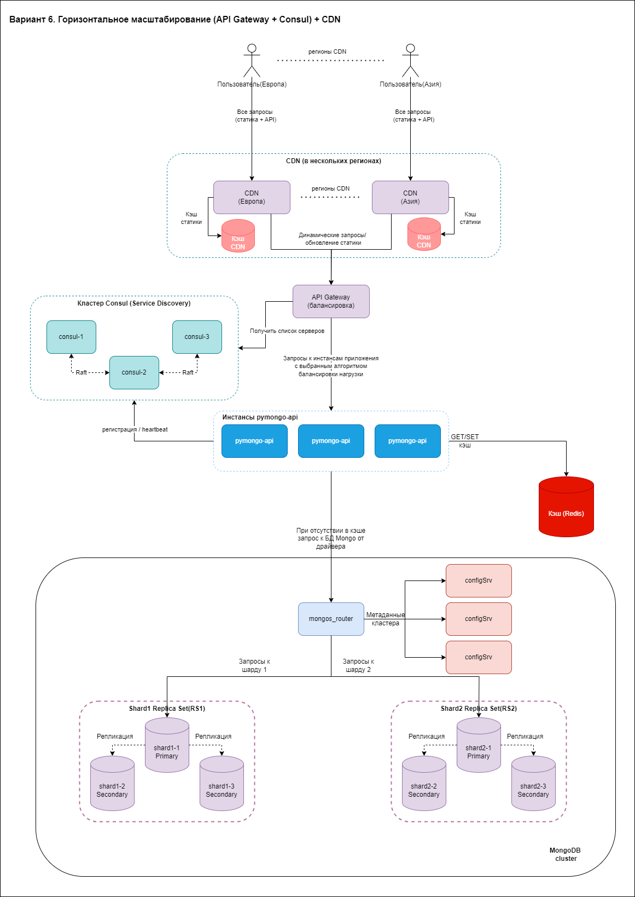

# Задание 1. Планирование
## Ваша задача — реализовать шардирование, репликацию и кеширование. Чтобы это сделать, распланируйте изменения.
На основе этого шаблона вам нужно создать схему итогового решения. Рекомендуем работать над ней в несколько этапов. Вот первые три шага:
1. Подготовьте первый вариант схемы. Изобразите, как вы будете использовать шардирование в MongoDB, чтобы повысить производительность. Двух шардов будет достаточно.
2. Составьте второй вариант схемы. Изобразите, как будет реализована репликация MongoDB для повышения отказоустойчивости. Чтобы это сделать, скопируйте первый вариант схемы и доработайте его, чтобы для каждого шарда была настроена репликация. На этом этапе у каждого шарда должно быть по три реплики. 
3. И наконец, на третьем варианте схемы изобразите вашу реализацию кеширования, чтобы повысить производительность ещё больше. Чтобы это сделать, скопируйте второй вариант схемы и добавьте инстанс Redis для кеширования запросов приложения к MongoDB

## Отчет
## Вариант 1. Шардирование

## Вариант 2. Репликация

## Вариант 3. Кеширование

# Задание 5. Service Discovery и балансировка с API Gateway
Сейчас у онлайн-магазина «Мобильный мир» развёрнут только один инстанс приложения. Это может вызвать простои в случае перезапуска сайта. Например, при обновлении. К тому же один инстанс может просто не справиться с нагрузкой. Чтобы решить эту проблему, нужно реализовать горизонтальное масштабирование сайта.

Если запустить несколько инстансов, то непонятно, на какой из них подавать трафик. Для распределения трафика используйте API Gateway.

Ещё нужно как-то сообщать API Gateway об изменении количества инстансов. Например, что нужно добавить новые инстансы в балансировку или убрать оттуда удалённые. Чтобы решить эту проблему, используйте Hashicorp Consul для Service Discovery.

Составьте четвёртый вариант схемы, на котором вы покажете реализацию горизонтального масштабирования сайта. Для этого скопируйте третий вариант, добавив на схему API Gateway для балансировки и Consul для Service Discovery.
## Отчет
## Вариант 4. Горизонтальное масштабирование (API Gateway + Consul)

# Задание 6. CDN
Чтобы ускорить доставку статического контента пользователям в разных регионах, нужно использовать CDN. Составьте пятый вариант схемы, на котором вы это реализуете. Для этого скопируйте предыдущий (четвёртый) вариант, добавив на него сервис CDN в нескольких регионах.
## Отчет
## Вариант 5. Горизонтальное масштабирование (API Gateway + Consul) + CDN
